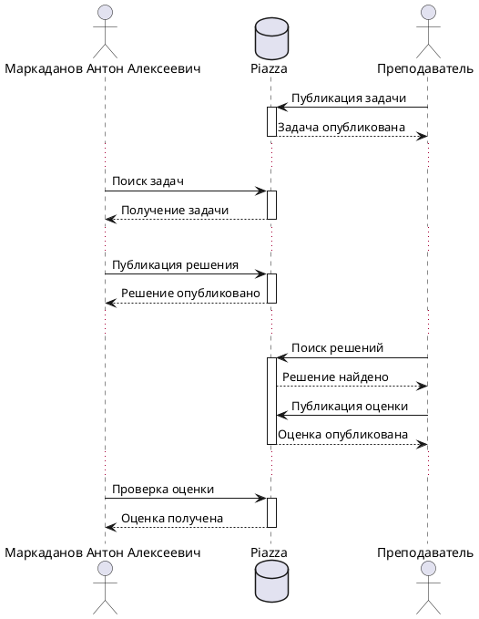

# Задания
* [Первоисточник](https://github.com/true-grue/kisscm/blob/main/pract/pract6.md)
* [Сохраненные локально](tasks.md)

# Решения
## Задача №1
$\displaystyle\int_{x}^{\infin}{\frac{dt}{t(t^{2}-1\log{t}}}=\int_{x}^{\infin}{\frac{1}{t\log{t}}\Bigg(\sum_{m}{t^{-2m}}\Bigg)}dt=\sum_{m}\int_{x}^{\infin}{\frac{t^{-2m}}{t\log{t}}}dt \overset{(u=t^{-2m})}{=}-\sum_{m}li(x^{-2m)}~~~Маркаданов~Антон~Алексеевич$

## Задача №2

